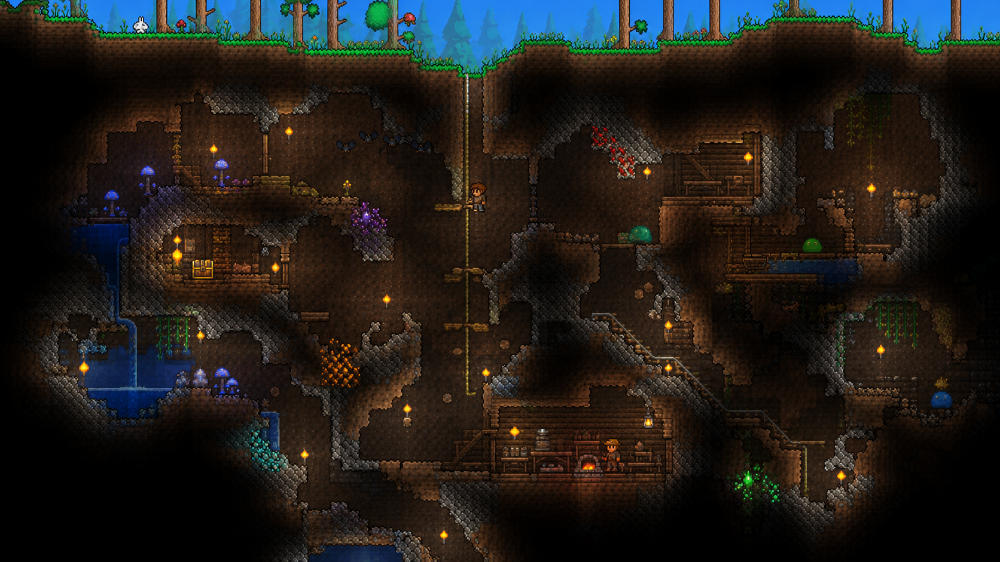
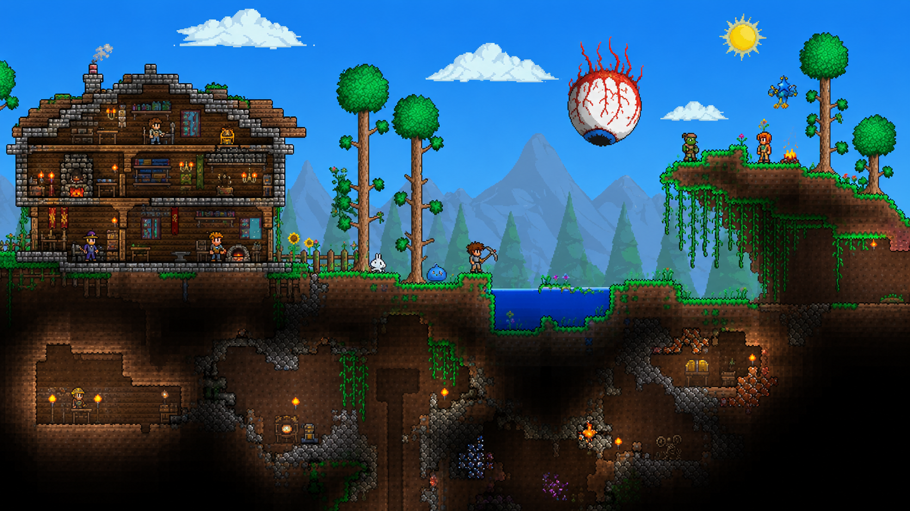
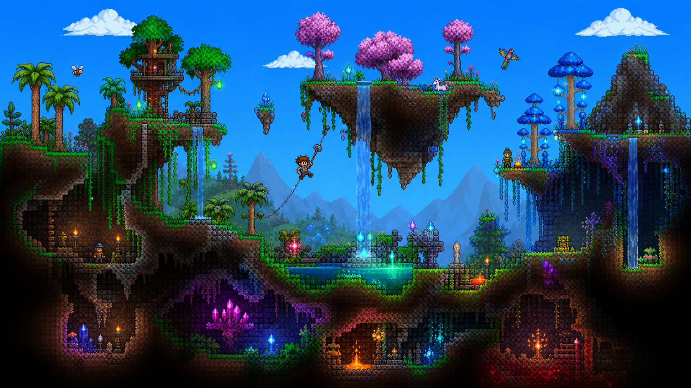
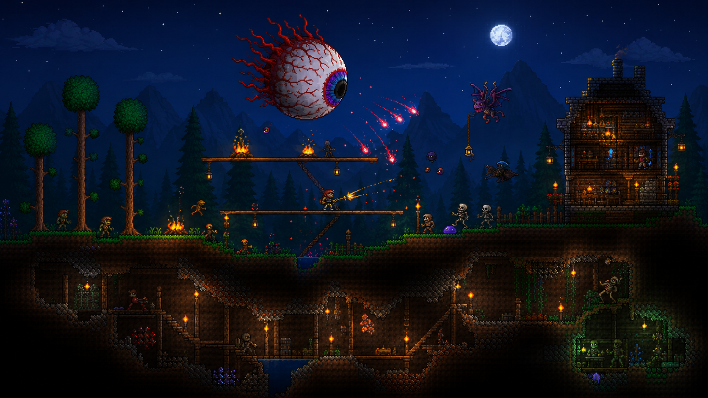

<p align="center">
  
</p>

<p align="center">
  <strong>Source-traceable Terraria save archive with curated imports, original projects, and automated tooling.</strong>
</p>

<p align="center">
  <a href="https://github.com/appleweiping/my-terraria/blob/main/LICENSE"></a>
  <a href="https://git-lfs.github.com/"></a>
  <a href="https://store.steampowered.com/app/105600/Terraria/"></a>
</p>

---

## Overview

A structured, version-controlled archive of Terraria save data — personal worlds, players, curated third-party imports, and original flagship builds. Every binary is stored via Git LFS, every import carries full provenance, and every expansion follows documented governance rules.

**72 personal worlds** | **91 personal players** | **4 public imports** | **5 original projects** | **TerrariaAgent Framework v2.1**

---

## Showcase

<p align="center">
  
</p>

<p align="center">
  
</p>

<p align="center">
  
</p>

---

## Architecture

```
my-terraria/
├── Terraria_saves/
│   ├── Players/              # 91 personal player files
│   ├── Worlds/               # 72 personal world files
│   └── imported/             # Public third-party imports (Git LFS)
├── originals/                # 5 original flagship projects
│   ├── astral-forge-vault/   # Ultimate storage archive hub
│   ├── biome-encyclopedia/   # Every biome documented
│   ├── boss-rush-colosseum/  # Every boss, arena-optimized
│   ├── starter-academy/      # New player progression guide
│   └── wiring-masterclass/   # Logic gates & mechanism demos
├── inventory/                # File inventory, hashes, restore guidance
├── external-sources/         # Provenance records, import decisions
├── private-imports/          # .gitignored — license-restricted
├── docs/                     # Documentation and assets
├── AGENTS.md                 # Governance for automated contributors
├── CLAUDE.md                 # Multi-agent collaboration config
└── CONTEXT.md                # Domain context for agent handoffs
```

---

## Featured: Astral Forge Vault

The repository's original flagship — a purpose-built archive hub world for maximum utility and completeness.

| Property | Value |
|----------|-------|
| Profile | Vanilla 1.4.x, Large, Master mode |
| Seed | `getfixedboi` base |
| Chests | 634 |
| Signs | 46 |
| Paired characters | 5 (Astral Warden, Nebula Archivist, Vortex Curator, Stardust Keeper, Solar Courier) |

---

## Public Import Collection

| Save | Category | License |
|------|----------|---------|
| The Story of Red Cloud | Adventure / RPG | Public Domain |
| The Story of Red Cloud — Xelvaa Remix | Adventure / Dark Souls | Public Domain |
| All Boss Battle Arenas Expert | Boss arena / Combat | CC BY-NC 3.0 |
| SUNV XTRA All Items Hub 1.4.5 Master | Compact all-items | GPL-3.0 |

Full provenance records in `external-sources/`.

---

## Terraria Agent Framework (v2.1)

Generate worlds and characters programmatically:

```powershell
dotnet run -- --spec my-world.json --output ./

# [*] Loading base world template...
# [*] Placing 15 biome sections...
# [*] Building castle at (1000, 400)...
# [*] Creating teleporter network...
# [*] Generating 5 paired characters...
# [*] Done. Output: My_Epic_World.wld (11.3 MB)
```

Capabilities: programmatic world generation, NPC housing placement, chest inventory population (5450+ items), teleporter wiring, biome painting, character creation with loadouts, SHA-256 integrity verification.

Built on .NET 8 + TEdit core libraries, plus dependency-free catalog tooling for archive QA.

### Catalog and Validation

The v2.1 catalog layer generates a deterministic public inventory summary, original-project matrix, public-import provenance table, version compatibility matrix, and quality gates:

```powershell
python tools/build_catalog.py
python tools/build_catalog.py --check
```

Outputs:

- `inventory/CATALOG.md` — human-readable archive catalog
- `inventory/catalog.json` — machine-readable catalog for future automation

---

## Quick Start

```powershell
# Clone with LFS
git lfs install
git clone https://github.com/appleweiping/my-terraria.git
cd my-terraria
git lfs pull

# Restore to Terraria
Copy-Item "Terraria_saves\Worlds\*.wld" `
    -Destination "$env:USERPROFILE\Documents\My Games\Terraria\Worlds" -Force
Copy-Item "Terraria_saves\Players\*.plr" `
    -Destination "$env:USERPROFILE\Documents\My Games\Terraria\Players" -Force
```

---

## Contributing

Contributions must follow the expansion protocol in [`AGENTS.md`](AGENTS.md):

1. Search broadly (GitHub, CurseForge, Steam Workshop, forums)
2. Prefer high-signal saves (popular, novel, complete, well-documented)
3. Use Git LFS for all binary save files
4. Record full provenance (source URL, author, SHA-256, license)
5. Respect licensing — only redistribution-compatible saves go public

---

## Roadmap

See [`docs/ROADMAP.md`](docs/ROADMAP.md) for planned milestones.

---

## License

Original content licensed under [`LICENSE`](LICENSE). Third-party saves retain their original licenses — see [`THIRD_PARTY_NOTICES.md`](THIRD_PARTY_NOTICES.md).
